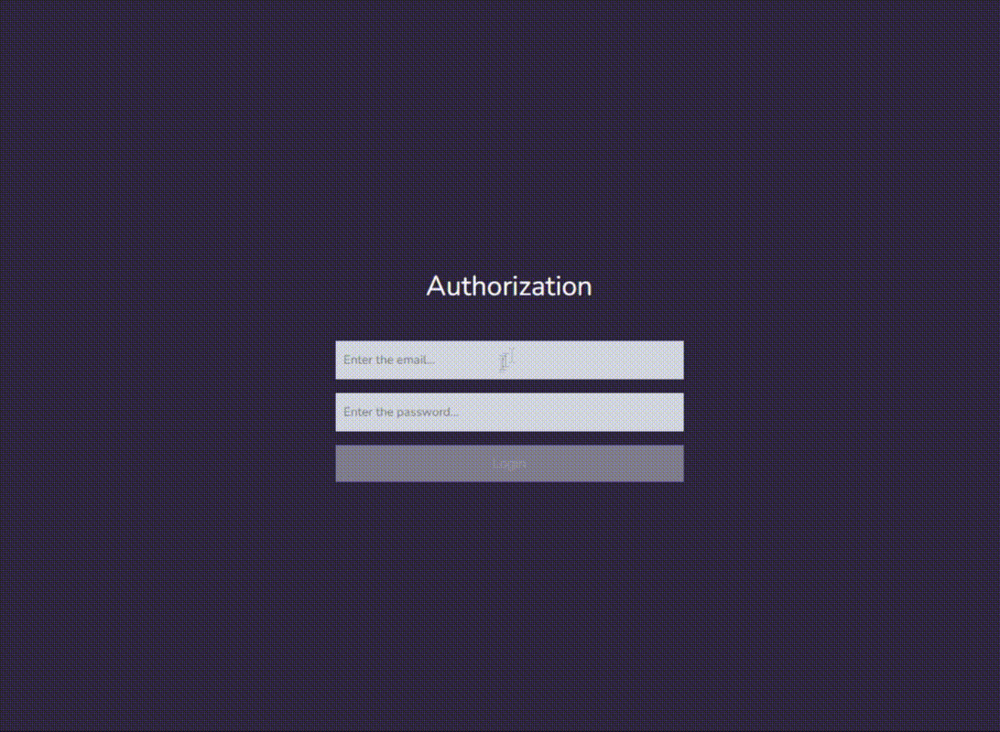

# Simple CRUD

## How to launch:

npm:

    npx json-server --watch src/db.json --port 3001
    npm start

Need enter the data below for entry:

Login: `admin@gmail.com`  
Password: `admin`

## Stack:
1. React
2. MobX
3. Typescript
4. Json-server
